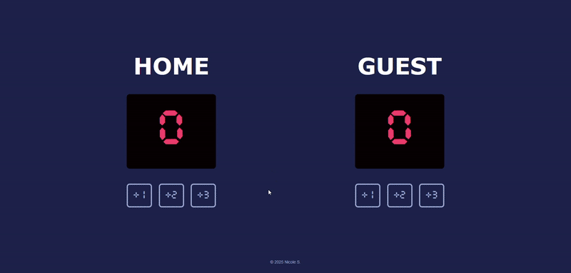
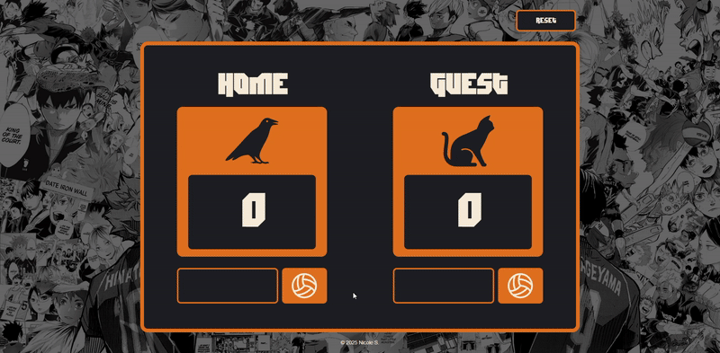

# M2 Basketball Scoreboard
The files in this folder are the current version of the project with stretch goals implemented. 

Below are demos comparing both versions.

---

### Base Version

#### Base requirements:
- ~~Follow the design.~~
- ~~Make all six buttons work.~~

---

### Stretch Goals Version

#### Stretch goals achieved:
- ~~Add a "New Game" button.~~
- ~~Highlight which team is leading.~~
- ~~Change the design or make the scoreboard for a different game.~~
- Add a few more counters (e.g. period, fouls, timer).
