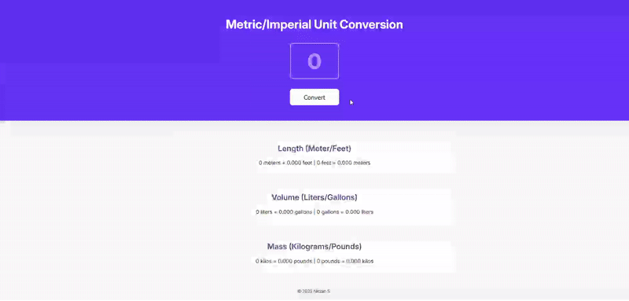

# M2 Unit Converter
The files in this folder are the final version of the project with stretch goals implemented. 

Below are demos comparing both versions.

---

### Base Version

#### Base requirements:
- ~~Follow the design.~~
- ~~Generate all conversions when the user clicks "Convert".~~
- ~~Round the numbers down to three decimal places.~~

---

### Stretch Goals Version
NO STRETCH GOALS.
